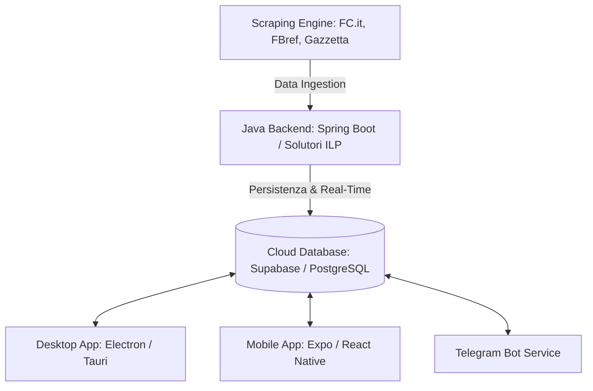
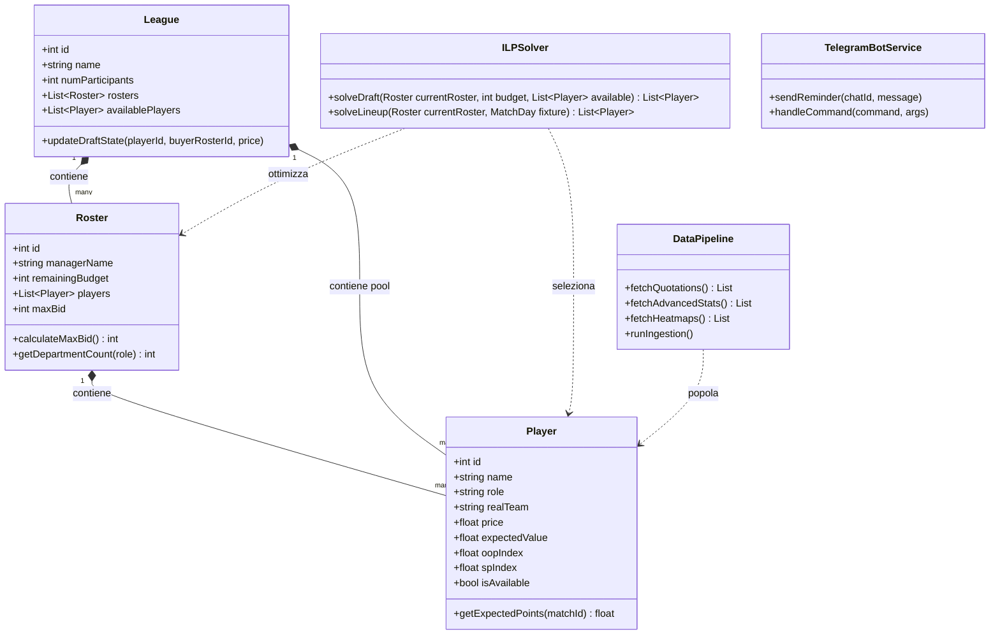
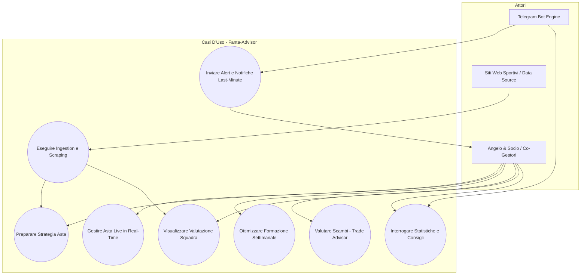
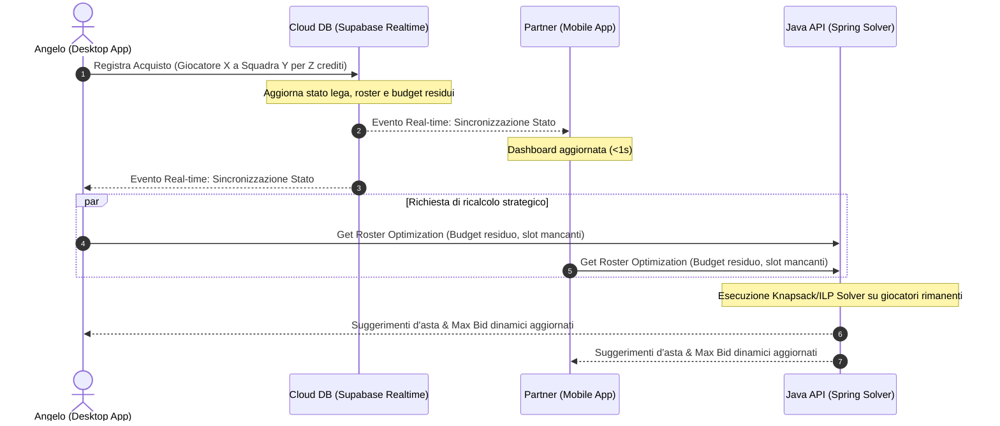

# Software Requirements Specification (SRS)
## Progetto: Fantacalcio 26/27 Advisor (Fanta-Advisor)

**Autori**: Antigravity (AI Coding Assistant) & Angelo (Product Owner / Software Engineer)  
**Versione**: 1.0.0  
**Data**: 2026-07-19  

---

### 1. Introduzione

#### 1.1 Scopo
Questo documento specifica i requisiti software per l'applicazione **Fanta-Advisor**, progettata per fornire un vantaggio competitivo strategico nella stagione di Fantacalcio 2026/2027. L'applicazione fornirà supporto analitico, predittivo e di ottimizzazione sia nella fase di asta live sia durante la gestione settimanale del campionato.

#### 1.2 Definizione del Prodotto
Fanta-Advisor è un sistema multi-canale (Desktop, Mobile, Telegram Bot) composto da:
*   Un **Backend centralizzato** in Java (Spring Boot) che si occupa di scraping dati, esecuzione di modelli predittivi e ottimizzazione matematica.
*   Un **Database Cloud** condiviso per la persistenza dei dati e lo scambio in tempo reale.
*   Interfacce client per la visualizzazione delle metriche e l'interazione durante l'asta e la stagione.

#### 1.3 Acronimi e Definizioni
*   **FDR (Fixture Difficulty Rating)**: Indice che misura la difficoltà della partita successiva per una determinata squadra/giocatore.
*   **ILP (Integer Linear Programming)**: Programmazione Lineare Intera, tecnica matematica per ottimizzare una funzione obiettivo lineare sotto vincoli lineari con variabili intere.
*   **EV (Expected Value / Valore Atteso)**: Stima dei punti attesi che un giocatore realizzerà in una giornata o nell'arco della stagione.
*   **xG / xA (Expected Goals / Expected Assists)**: Metriche avanzate che stimano la probabilità che un tiro diventi gol o un passaggio si trasformi in assist.
*   **Clean Sheet (Portiere Imbattuto)**: Bonus associato a un portiere che non subisce gol (+1).
*   **OOP (Out Of Position - Fuori Ruolo)**: Calciatore classificato in un ruolo difensivo o arretrato nel listone del Fantacalcio, ma che sul terreno di gioco reale viene impiegato regolarmente in posizioni avanzate (es. difensore centrale usato come centrocampista o terzino che gioca stabilmente come ala offensiva).
*   **Set-Piece Specialist (Specialista Piazzati)**: Giocatore incaricato di battere calci di rigore, punizioni o calci d'angolo per la propria squadra.

---

### 2. Descrizione Generale

#### 2.1 Prospettiva del Prodotto
L'applicazione opera come un assistente decisionale co-operativo. Si interfaccia con siti web sportivi esterni tramite pipeline di scraping e fornisce una dashboard sincronizzata a due co-gestori della stessa squadra (Angelo e il suo compagno di squadra).

#### 2.2 Funzionalità del Sistema
1.  **Data Ingestion Pipeline**: Scraping automatico a richiesta o schedulato di voti, quotazioni, probabili formazioni, infortuni, metriche avanzate (xG, xA), posizioni medie in campo (coordinate medie/heatmaps delle partite e amichevoli precampionato) e statistiche sull'esecuzione dei calci piazzati (rigori, punizioni, corner).
2.  **Modulo Asta Live (Real-Time)**:
    *   Tracciamento dei budget residui dei ~10 partecipanti.
    *   Registrazione immediata dei giocatori assegnati.
    *   Suggerimento dell'offerta massima dinamica (Bid Advisor) per evitare sovraprezzi.
    *   Ricalcolo dinamico dell'allocazione del budget rimanente sui ruoli mancanti.
3.  **Modulo Campionato**:
    *   **Ottimizzatore Formazione**: Algoritmo che suggerisce e calcola il punteggio atteso della miglior formazione settimanale (es. 3-4-3, 4-3-3, ecc.) in base ai giocatori che la compongono.
    *   **Trade Advisor**: Valutatore dell'impatto di uno scambio proposto sulla rosa complessiva.
    *   **Mercato Svincolati**: Identificazione di giocatori liberi con alto EV o con trend di prestazioni in crescita.
    *   **Sistema di Valutazione Squadra (Team Rating)**: Analisi qualitativa e quantitativa dell'intera rosa (titolari e riserve) propria e degli avversari, per identificarare lacune e punti di forza per reparto.
4.  **Telegram Bot**:
    *   Invio di notifiche push per la scadenza della formazione.
    *   Notifiche last-minute su infortuni di giocatori in rosa.
    *   Comandi interattivi per interrogare statistiche rapide o chiedere consigli sulla formazione.

#### 2.3 Classi di Utenti e Caratteristiche
*   **Co-Gestori**: Angelo e il suo compagno di squadra. Hanno pari diritti di lettura/scrittura sulla rosa, sul budget dell'asta e sulle decisioni di formazione. Richiedono una sincronizzazione dei dati a bassissima latenza (specialmente durante l'asta).

#### 2.4 Vincoli di Progettazione
*   **Regolamento**: Fantacalcio Classico (ruoli P, D, C, A), lega a circa 10 partecipanti, asta a chiamata classica, bonus "Portiere Imbattuto" attivo.
*   **Latenza Asta**: Durante l'asta live, l'inserimento di un acquisto e il ricalcolo del budget residuo degli avversari deve avvenire in meno di 1 secondo su tutti i dispositivi connessi.

---

### 3. Requisiti Specifici

#### 3.1 Requisiti di Interfaccia Esterna

##### 3.1.1 Interfaccia Utente (UI)
*   **Desktop App**: Layout a pannelli multipli per l'asta. Visualizzazione tabellare ordinabile per EV, costo storico, e slot rimanenti degli avversari. Grafici in tempo reale della distribuzione del budget rimanente delle altre squadre.
*   **Mobile App**: Ottimizzata per l'uso con una sola mano. Pulsante rapido "Assegna Giocatore" con selettore del prezzo d'acquisto e della squadra acquirente.
*   **Telegram Bot**: Interfaccia a pulsanti inline (Inline Keyboard) per comandi veloci (es. `/formazione`, `/info [Giocatore]`).

##### 3.1.2 Interfacce Software & Data Sources
*   **Scraper FC.it**: Parsing HTML/JSON per recuperare la lista ufficiale dei calciatori, i ruoli e le quotazioni (iniziali e correnti), oltre ai voti e pagelle post-giornata.
*   **Scraper FBref/Understat/SofaScore**: Estrazione delle tabelle di performance (xG, xA, tiri, passaggi chiave, clean sheets storici), delle mappe posizionali medie (average position coordinates/heatmaps delle ultime partite/amichevoli), e dei set-piece takers (battitori di rigori, punizioni e corner).
*   **Scraper Notizie (Gazzetta/FC.it)**: Monitoraggio delle pagine relative alle probabili formazioni ed indisponibili.

##### 3.1.3 Interfacce di Comunicazione
*   WebSocket o Subscription Real-Time (es. Supabase Realtime) per propagare gli aggiornamenti dell'asta istantaneamente tra Desktop App e Mobile App dei due gestori.

#### 3.2 Requisiti Funzionali (Dettaglio moduli)

##### 3.2.1 Algoritmi e Data Science (Il Core Analitico)
*   **Modulo Predittivo (ML)**:
    *   Calcolo del valore atteso del punteggio Fanta-voto ($EV_i$) per il giocatore $i$ nella giornata $g$:
        $$EV_i(g) = P(\text{voto}_i) \times \left[ \text{VotoBaseAtteso}_i + \sum (\text{ProbBonus}_k \times \text{ValoreBonus}_k) - \sum (\text{ProbMalus}_j \times \text{ValoreMalus}_j) \right]$$
    *   La probabilità di Clean Sheet del portiere deve influenzare positivamente il suo $EV$ includendo il bonus di +1.
    *   **Fattore OOP ($OOP_{Index}$)**: I giocatori con ruolo registrato come D o C, ma con baricentro posizionale medio avanzato ($Y_{medio} > \text{Soglia}$) e heatmaps offensive, vedono il loro $EV$ incrementato grazie a un moltiplicatore di proiezione dei bonus offensivi combinato con i bonus di clean sheet per reparto.
    *   **Indice Piazzati ($SP_{Index}$)**: Il calcolo dell'EV integra la quota di partecipazione ai calci piazzati della squadra:
        $$EV_{Piazzati, i} = \%Rigori_i \times EV_{Rigore} + \%Punizioni_i \times EV_{Punizione} + \%Corner_i \times EV_{Corner}$$
        Questo garantisce che giocatori di squadre medio-basse con monopolio dei piazzati abbiano un EV anomalamente alto e conveniente rispetto al prezzo di mercato.
*   **Modulo Ottimizzazione (ILP)**:
    *   *Problema dell'Asta (Roster Construction)*: Massimizzare l'EV totale della rosa sotto vincoli di budget $B$ e composizione della rosa (es. 3 P, 8 D, 8 C, 6 A per il Classico):
        $$\max \sum_{i \in \text{Giocatori}} x_i \cdot EV_i \quad \text{con } x_i \in \{0, 1\}$$
        Soggetto a:
        $$\sum_{i} x_i \cdot \text{CostoEstimato}_i \le B$$
        $$\sum_{i \in \text{Ruolo}} x_i = \text{TargetRuolo}$$
    *   *Problema della Formazione Settimanale*: Massimizzare l'EV della formazione titolare di giornata sotto i vincoli dei moduli ammessi dal Fantacalcio Classico (es. 3-4-3, 3-5-2, 4-4-2, 4-3-3, 4-5-1, 5-3-2, 5-4-1). Il punteggio atteso della formazione ($EV_{Formazione}$) dipende strettamente dai singoli giocatori selezionati ed è calcolato come:
        $$EV_{Formazione} = \sum_{j \in Titolari} EV_j + f(Bench\_Depth)$$
        dove $f(Bench\_Depth)$ penalizza l'EV totale se le riserve in panchina hanno un'alta probabilità di "senza voto" o un EV troppo basso per coprire i titolari a rischio infortunio/panchina.
    *   *Sistema di Valutazione Squadra (Squad Rating Model)*: Algoritmo matematico per stimare la forza complessiva di un'intera rosa ($Rating_{Squadra}$):
        1. *Qualità dei Titolari*: EV medio ponderato dei migliori giocatori per ogni ruolo (es. top 1 P, top 4 D, top 4 C, top 3 A).
        2. *Profondità e Affidabilità della Panchina*: Valutazione delle riserve (probabilità congiunta di garantire un voto valido in caso di assenza dei titolari).
        3. *Equilibrio tra Reparti*: Misura di bilanciamento per penalizzare rose eccessivamente sbilanciate (es. solo attacco forte e difesa insufficiente).
        4. *Proiezione di Stagione*: Stima dei fanta-punti totali attesi nell'arco delle 38 giornate di campionato.

##### 3.2.2 Gestione Asta Live
*   **Requisito F.1**: Il sistema deve permettere di registrare l'acquisto di un giocatore da parte di qualsiasi squadra della lega (identificando acquirente e prezzo).
*   **Requisito F.2 (Opponent Tracking)**: Ricalcolo immediato del "Budget Massimo Offeribile" (Maximum Bid) per ogni avversario, basato sul loro credito residuo e sul numero di slot vuoti che devono ancora riempire per regolamento (garantendo che abbiano almeno 1 credito per ogni slot rimanente).
*   **Requisito F.3 (Dynamic Bid Advisor)**: Suggerimento in tempo reale del valore di offerta consigliato per il giocatore correntemente all'asta, basato sull'EV del giocatore e sullo stato del mercato dei pari-ruolo ancora disponibili.

##### 3.2.3 Gestione Campionato, Valutazione Squadra e Telegram Bot
*   **Requisito F.4**: Ogni giovedì/venerdì (o 24 ore prima del primo match della giornata), il Bot Telegram invia una notifica push con l'EV stimato della formazione ottimale suggerita.
*   **Requisito F.5**: A 2 ore dalla consegna delle formazioni, il Bot controlla se ci sono notizie dell'ultimo minuto (infortuni o panchine inaspettate) riguardanti i titolari scelti, notificando i gestori se l'EV scende sotto una soglia critica o se il giocatore rischia il "senza voto".
*   **Requisito F.6 (Team Evaluation System)**: L'applicazione fornisce una dashboard "Valutazione Squadra" che analizza la rosa dell'utente e quella di tutti gli avversari (subito dopo l'asta e aggiornabile durante gli scambi). Calcola un punteggio di forza globale (da 1 a 100) per reparto (Porta, Difesa, Centrocampo, Attacco) e stima una classifica finale simulata della lega tramite 10.000 simulazioni Monte Carlo delle giornate rimanenti.
*   **Requisito F.7 (OOP Detector)**: Il sistema analizza i dati posizionali delle ultime partite e delle amichevoli precampionato per evidenziare i "finti difensori" o "finti centrocampisti", contrassegnandoli con un badge OOP e ordinando la lista dei desiderabili all'asta per guadagno posizionale potenziale.
*   **Requisito F.8 (Set-Piece Monopoly Analyzer)**: Il sistema indicizza i tiratori di piazzati di ogni squadra e calcola un punteggio di "Monopolio Piazzati". Gli utenti possono filtrare la lista dei giocatori svincolati o acquistabili per evidenziare tiratori low-cost in grado di assicurare bonus ricorrenti.

#### 3.4 Requisiti Non Funzionali

##### 3.4.1 Affidabilità e Tolleranza ai Guasti
*   Se la connessione internet cade durante l'asta, il client Desktop/Mobile deve memorizzare le ultime transazioni localmente e sincronizzarle con il cloud DB non appena la connessione viene ripristinata.

##### 3.4.2 Sicurezza e Integrità
*   L'accesso al DB Cloud e alle API deve essere protetto da credenziali/chiavi API private per evitare che avversari della lega possano accedere alle stime di budget o alla strategia d'asta di Angelo e del suo compagno.

---

### 4. Diagrammi di Sistema

#### 4.1 Diagramma delle Classi (Class Diagram)
Questo diagramma modella la struttura dati del backend in Java e le relazioni tra le entità principali del dominio di gioco.

#### 4.2 Diagramma dei Casi d'Uso (Use Case Diagram)
Questo diagramma illustra come gli attori (Angelo & Socio, Fonti Dati esterne e Telegram Bot) interagiscono con le funzionalità del sistema Fanta-Advisor.

#### 4.3 Diagramma di Sequenza (Sequence Diagram)
Questo diagramma descrive il flusso di events in tempo reale durante l'asta live, evidenziando la sincronizzazione tra i co-gestori e il ricalcolo degli indici strategici operato dal solutore ILP.

